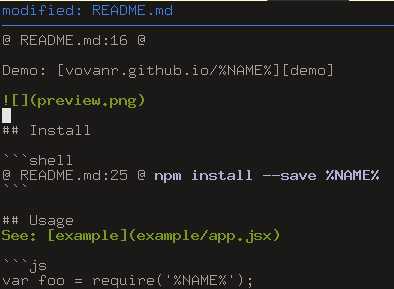

# vovanr-project-logos


[![Commitizen friendly][commitizen-image]][commitizen-url]

[![NPM version][npm-image]][npm-url]
[![Build Status][travis-image]][travis-url]
[![Dependency Status][depstat-image]][depstat-url]
[![DevDependency Status][depstat-dev-image]][depstat-dev-url]

> Logo collection of VovanR's services

Demo: [vovanr.github.io/vovanr-project-logos][demo]



## Install

```shell
npm install --save vovanr-project-logos
```

## Usage
See: [example](example/app.jsx)

```js
var foo = require('vovanr-project-logos');

foo()
//=> Foo
```

## API

### foo(bar, [options])

#### bar

Type: `string`

Bar to foo

#### options

Type: `Object`

##### baz

Type: `string`<br>
Default: `-`

## License
MIT © [Vladimir Rodkin](https://github.com/VovanR)

[demo]: https://vovanr.github.io/vovanr-project-logos

[commitizen-url]: https://commitizen.github.io/cz-cli/
[commitizen-image]: https://img.shields.io/badge/commitizen-friendly-brightgreen.svg?style=flat-square

[npm-url]: https://npmjs.org/package/vovanr-project-logos
[npm-image]: https://img.shields.io/npm/v/vovanr-project-logos.svg?style=flat-square

[travis-url]: https://travis-ci.org/VovanR/vovanr-project-logos
[travis-image]: https://img.shields.io/travis/VovanR/vovanr-project-logos.svg?style=flat-square

[depstat-url]: https://david-dm.org/VovanR/vovanr-project-logos
[depstat-image]: https://david-dm.org/VovanR/vovanr-project-logos.svg?style=flat-square

[depstat-dev-url]: https://david-dm.org/VovanR/vovanr-project-logos
[depstat-dev-image]: https://david-dm.org/VovanR/vovanr-project-logos/dev-status.svg?style=flat-square
